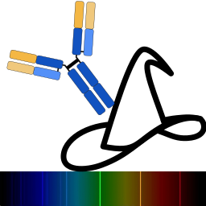

<div id="top">

<!-- HEADER STYLE: MODERN -->
<div align="left" style="position: relative; width: 100%; height: 100%; ">



# AbWizard

<em>User-Friendly Antibody Panel Constructor<em>

<!-- BADGES -->


<!-- default option, no dependency badges. -->


<!-- default option, no dependency badges. -->

</div>
</div>
<br clear="right">

---

## 💎 Table of Contents

- [💎 Table of Contents](#-table-of-contents)
- [🔷 Overview](#-overview)
- [🔶 Features](#-features)
- [💠 Project Structure](#-project-structure)
    - [🔹 Project Index](#-project-index)
- [🔸 Getting Started](#-getting-started)
    - [🟦 Prerequisites](#-prerequisites)
    - [🟨 Installation](#-installation)
    - [🟧 Usage](#-usage)
    - [🟥 Testing](#-testing)
- [✨ Roadmap](#-roadmap)
- [⭐ Contributing](#-contributing)
- [💫 License](#-license)
- [✧ Acknowledgments](#-acknowledgments)

---

## 🔷 Overview

AbWizard is an open-source scientific tool that simplifies the process of solving antibody panels, providing a user-friendly interface and an efficient analysis process.

**Why AbWizard?**

AbWizard is designed to streamline the process of solving antibody panels. The core features include:

- **🔧 Automated Setup:** The 'install.sh' script automates the setup process, ensuring a smooth and error-free installation experience.
- **👥 User-Friendly Interface:** The GUI provides a simple way for users to input and manage data, making the tool accessible to all users.
- **🔬 Efficient Analysis:** AbWizard filters antibodies depending on insturment configuration, finds the best solution for antibody panels, and saves the results, saving time and effort.
- **🌐 Open-Source:** Governed by the Apache License 2.0, AbWizard ensures the project's open-source nature while protecting the rights of contributors and users.

---

## 🔶 Features

|      | Component       | Details                              |
| :--- | :-------------- | :----------------------------------- |
| ⚙️  | **Architecture**  | <ul><li>Written in Python</li><li>Uses PySide6 for GUI</li><li>Utilizes pandas for data manipulation</li></ul> |
| 🔩 | **Code Quality**  | <ul><li>Consistent coding style</li><li>Good use of Python idioms</li><li>Efficient use of pandas</li></ul> |
| 🔌 | **Integrations**  | <ul><li>Uses PyInstaller for creating standalone executables</li><li>Integrates with numpy, pandas, and PySide6 libraries</li></ul> |
| ⚡️  | **Performance**   | <ul><li>Efficient use of pandas for data manipulation</li><li>GUI built with PySide6 for smooth user experience</li></ul> |
| 📦 | **Dependencies**  | <ul><li>Managed with pip</li><li>Dependencies listed in requirements.txt</li><li>Includes numpy, pandas, PySide6, and PyInstaller</li></ul> |

---

## 💠 Project Structure

```sh
└── AbWizard/
    ├── AbWizard
    │   ├── __init__.py
    │   ├── gui.py
    │   └── wizard.py
    ├── LICENSE
    ├── abwizard.desktop
    ├── abwizard_icon.png
    ├── abwizard_icon.svg
    ├── install.sh
    ├── requirements.txt
    └── run_abwizard.sh
```

### 🔹 Project Index

<details open>
	<summary><b><code>ABWIZARD/</code></b></summary>
	<!-- __root__ Submodule -->
	<details>
		<summary><b>__root__</b></summary>
		<blockquote>
			<div class='directory-path' style='padding: 8px 0; color: #666;'>
				<code><b>⦿ __root__</b></code>
			<table style='width: 100%; border-collapse: collapse;'>
			<thead>
				<tr style='background-color: #f8f9fa;'>
					<th style='width: 30%; text-align: left; padding: 8px;'>File Name</th>
					<th style='text-align: left; padding: 8px;'>Summary</th>
				</tr>
			</thead>
				<tr style='border-bottom: 1px solid #eee;'>
					<td style='padding: 8px;'><b><a href='https://github.com/VergaJU/AbWizard/blob/master/abwizard.desktop'>abwizard.desktop</a></b></td>
					<td style='padding: 8px;'>- AbWizard.desktop serves as a desktop entry for the AbWizard application, a scientific tool designed to solve antibody panels<br>- It provides a user-friendly interface to launch the application, displaying an icon and a comment for user guidance<br>- Positioned within the Science and Biology categories, it enhances accessibility and organization of the application.</td>
				</tr>
				<tr style='border-bottom: 1px solid #eee;'>
					<td style='padding: 8px;'><b><a href='https://github.com/VergaJU/AbWizard/blob/master/run_abwizard.sh'>run_abwizard.sh</a></b></td>
					<td style='padding: 8px;'>- Run_abwizard.sh serves as the entry point for the AbWizard application<br>- It ensures the application is always launched from its root directory, checks for updates from the main branch on GitHub, activates the Python virtual environment, and initiates the GUI script<br>- Upon closure of the GUI, it deactivates the environment, signifying the end of the applications operation.</td>
				</tr>
				<tr style='border-bottom: 1px solid #eee;'>
					<td style='padding: 8px;'><b><a href='https://github.com/VergaJU/AbWizard/blob/master/LICENSE'>LICENSE</a></b></td>
					<td style='padding: 8px;'>- The LICENSE file provides the Apache License 2.0, which governs the use, reproduction, and distribution of the projects codebase<br>- It outlines the terms and conditions for contributions, derivative works, and the granting of copyright and patent licenses<br>- This license ensures the projects open-source nature while protecting the rights of contributors and users.</td>
				</tr>
				<tr style='border-bottom: 1px solid #eee;'>
					<td style='padding: 8px;'><b><a href='https://github.com/VergaJU/AbWizard/blob/master/install.sh'>install.sh</a></b></td>
					<td style='padding: 8px;'>- The install.sh script automates the setup process for the AbWizard application<br>- It checks for essential commands, sets up a Python virtual environment, installs necessary dependencies, and creates a.desktop launcher for easy access<br>- This ensures a smooth and error-free installation experience for users.</td>
				</tr>
				<tr style='border-bottom: 1px solid #eee;'>
					<td style='padding: 8px;'><b><a href='https://github.com/VergaJU/AbWizard/blob/master/requirements.txt'>requirements.txt</a></b></td>
					<td style='padding: 8px;'>- Requirements.txt outlines the necessary Python packages for the project, specifying versions to ensure compatibility<br>- It includes packages for data manipulation (numpy, pandas), application packaging (pyinstaller, altgraph), and user interface development (PySide6)<br>- This file is crucial for setting up a consistent development environment and for deploying the application.</td>
				</tr>
			</table>
		</blockquote>
	</details>
	<!-- AbWizard Submodule -->
	<details>
		<summary><b>AbWizard</b></summary>
		<blockquote>
			<div class='directory-path' style='padding: 8px 0; color: #666;'>
				<code><b>⦿ AbWizard</b></code>
			<table style='width: 100%; border-collapse: collapse;'>
			<thead>
				<tr style='background-color: #f8f9fa;'>
					<th style='width: 30%; text-align: left; padding: 8px;'>File Name</th>
					<th style='text-align: left; padding: 8px;'>Summary</th>
				</tr>
			</thead>
				<tr style='border-bottom: 1px solid #eee;'>
					<td style='padding: 8px;'><b><a href='https://github.com/VergaJU/AbWizard/blob/master/AbWizard/wizard.py'>wizard.py</a></b></td>
					<td style='padding: 8px;'>- Wizard.py in the AbWizard project serves as the main driver for the analysis process<br>- It filters antibodies based on compatibility with the instrument, finds the best solution for antibody panels, and saves the results to a CSV file<br>- The script operates by matching antibodies to lasers and emission channels, and recursively finding solutions for different marker combinations.</td>
				</tr>
				<tr style='border-bottom: 1px solid #eee;'>
					<td style='padding: 8px;'><b><a href='https://github.com/VergaJU/AbWizard/blob/master/AbWizard/gui.py'>gui.py</a></b></td>
					<td style='padding: 8px;'>- AbWizard/gui.py is a Graphical User Interface (GUI) for the Antibody Panel Solver application<br>- It provides a user-friendly interface for inputting and managing data related to lasers, filters, markers, and antibodies<br>- The GUI also includes a log output for tracking application processes and a button to initiate analysis<br>- It leverages the PySide6 library for GUI creation and the Wizard class for backend logic.</td>
				</tr>
			</table>
		</blockquote>
	</details>
</details>

---

## 🔸 Getting Started

### 🟦 Prerequisites

This project requires the following dependencies:

- **Programming Language:** Shell
- **Package Manager:** Pip
- **OS:** Linux

### 🟨 Installation

Build AbWizard from the source and intsall dependencies:

1. **Clone the repository:**

    ```sh
    ❯ git clone https://github.com/VergaJU/AbWizard
    ```

2. **Navigate to the project directory:**

    ```sh
    ❯ cd AbWizard
    ```

3. **Install the dependencies:**


	```sh
	❯ ./install.sh
	```

### 🟧 Usage

Double click on the icon, insert instrument configuration, markers and atibodies, run analysis


### ✨ Output

`.csv` file saved by default in the desktop.

---

## ⭐ Contributing

- **💬 [Join the Discussions](https://github.com/VergaJU/AbWizard/discussions)**: Share your insights, provide feedback, or ask questions.
- **🐛 [Report Issues](https://github.com/VergaJU/AbWizard/issues)**: Submit bugs found or log feature requests for the `AbWizard` project.
- **💡 [Submit Pull Requests](https://github.com/VergaJU/AbWizard/blob/main/CONTRIBUTING.md)**: Review open PRs, and submit your own PRs.

<details closed>
<summary>Contributing Guidelines</summary>

1. **Fork the Repository**: Start by forking the project repository to your github account.
2. **Clone Locally**: Clone the forked repository to your local machine using a git client.
   ```sh
   git clone https://github.com/VergaJU/AbWizard
   ```
3. **Create a New Branch**: Always work on a new branch, giving it a descriptive name.
   ```sh
   git checkout -b new-feature-x
   ```
4. **Make Your Changes**: Develop and test your changes locally.
5. **Commit Your Changes**: Commit with a clear message describing your updates.
   ```sh
   git commit -m 'Implemented new feature x.'
   ```
6. **Push to github**: Push the changes to your forked repository.
   ```sh
   git push origin new-feature-x
   ```
7. **Submit a Pull Request**: Create a PR against the original project repository. Clearly describe the changes and their motivations.
8. **Review**: Once your PR is reviewed and approved, it will be merged into the main branch. Congratulations on your contribution!
</details>

<details closed>
<summary>Contributor Graph</summary>
<br>
<p align="left">
   <a href="https://github.com{/VergaJU/AbWizard/}graphs/contributors">
      
   </a>
</p>
</details>

---

## 💫 License

Abwizard is protected under the [LICENSE](https://choosealicense.com/licenses) License. For more details, refer to the [LICENSE](https://choosealicense.com/licenses/) file.

---


<div align="right">

[![][back-to-top]](#top)

</div>


[back-to-top]: https://img.shields.io/badge/-BACK_TO_TOP-151515?style=flat-square


---
